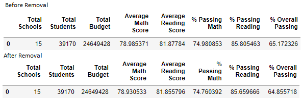

# school-district-analysis

## Overview

The purpose of this project is to re-analyze data for Thomas High School in PyCity with the standardized test scores for the 9th grade class removed.  This analysis has been prompted by suspicion of academic dishonesty in the reporting of the grades for Thomas High School's 9th grade class. 

## Results

### Effect of Removal on District Metrics

Removing the math and reading scores from Thomas High School's 9th grade class had the following effects on the school district's metrics:

* District summary (Before removal -> After removal):
    * Average math score: 78.985371 -> 78.930533
    * Percentage passing math: 74.890853% -> 74.760392%
    * Average reading score: 81.87784 -> 81.855796
    * Percentage passing reading: 85.805463% -> 85.659666%
    * Overall percentage of students passing: 65.172326% -> 64.855718%
    
* Thomas High School summary (Before removal -> After Removal):
    * Average math schore: 83.418349 -> 83.350937
    * Percentage passing math: 93.272171% -> 93.185690%
    * Average reading score: 83.848930 -> 83.896082 (Increase)
    * Percentage passing reading: 97.308869% -> 97.018739%
    * Overall percentage of students passing: 90.948012% -> 90.630324%
    
* Thomas High School's relative performance to other schools:
    * Thomas High School remained second in performance after Cabrera High School and ahead of Griffin High School
    
* Affect on math and reading scores by grade:
    * Removing Thomas High School's math and reading scores did not impact the math and reading scores by grade since they were simply no longer present in the data
    
* Affect on scores by school spending per student (Before removal -> After removal):
    * Average math score for schools spending $630 to $644 per student: 78.518855 -> 75.502002
    * Percentage passing math for schools spending $630 to $644 per student: 73.484209% -> 73.462589%
    * Average reading score for schools spending $630 to $644 per student: 81.624473 -> 81.636261 (Increase)
    * Percentage passing reading for schools spending $630 to $644 per student: 84.391793% -> 84.319261%
    * Overall percentage of students passing for schools spending $630 to $644 per student: 62.857656% -> 62.778233%
    
* Affect on scores by school size (Before removal -> After removal):
    * Average math score for medium-sized schools (1000-2000): 83.374684 -> 83.361201
    * Percentage passing math for medium-sized schools (1000-2000): 93.599695% -> 93.582398%
    * Average reading score for medium-sized schools (1000-2000): 83.864438 -> 83.873869
    * Percentage passing reading for medium-sized schools (1000-2000): 96.790680% -> 96.732654%
    * Overall percentage of students passing for medium-sized schools (1000-2000): 90.621535% -> 90.557997%
    
* Affect on scores by school type (Before removal -> After removal):
    * Average math score for charter schools: 83.473852 -> 83.465425
    * Percentage passing math for charter schools: 93.620830% -> 93.610020%
    * Average reading score for charter schools: 83.896421 -> 83.902315
    * Percentage passing reading for charter schools: 96.586489% -> 96.550223%
    * Overall percentage of students passing for charter schools: 
    

## Summary

